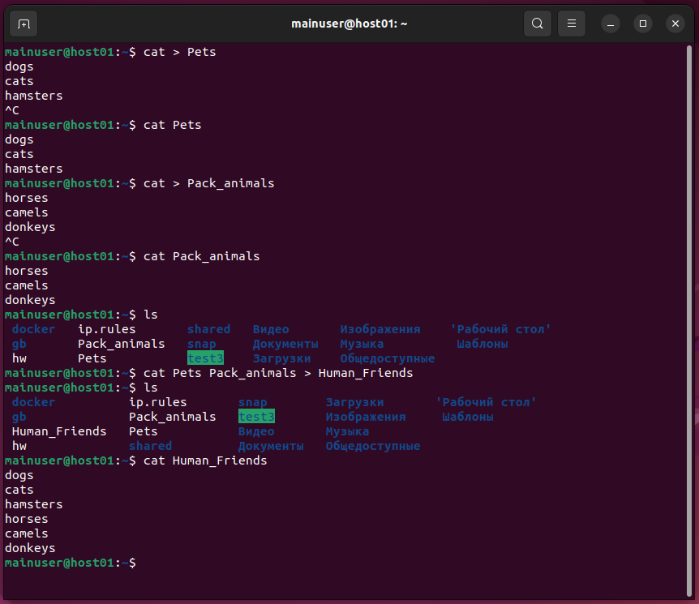
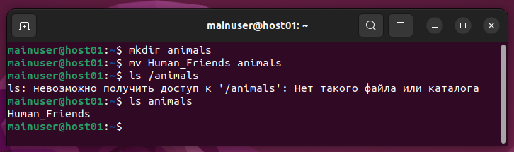
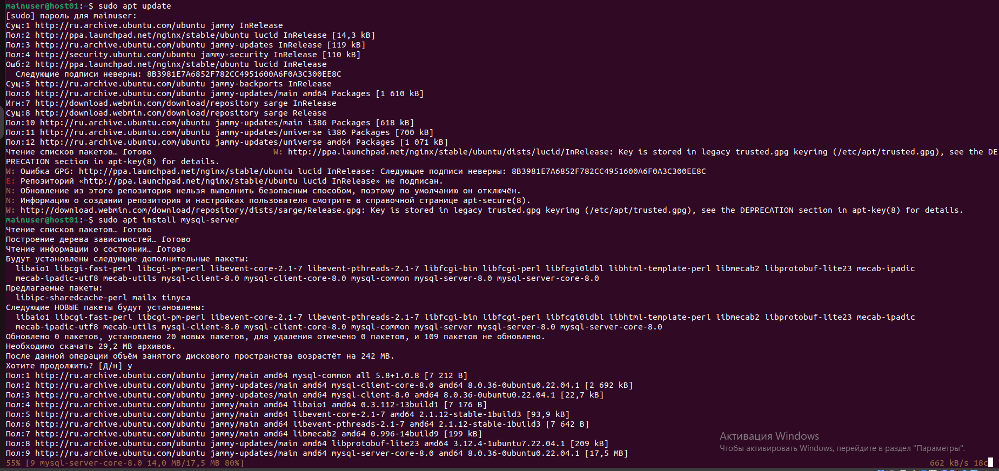
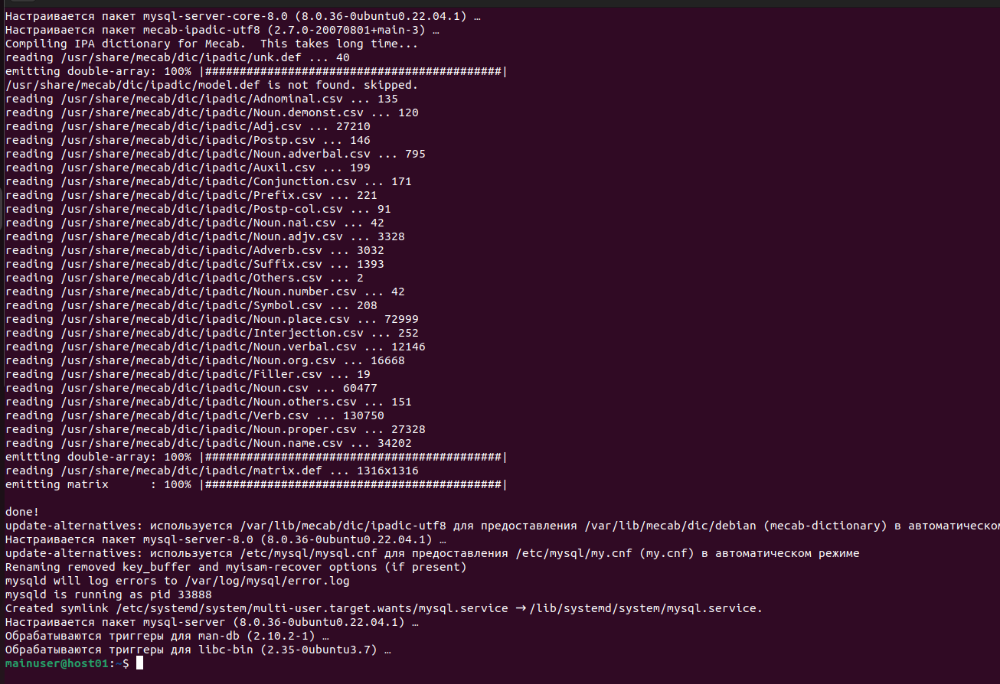
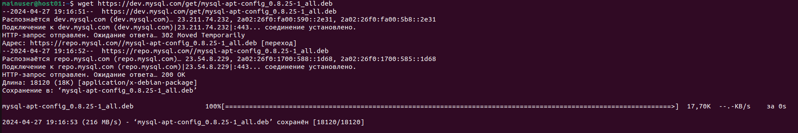
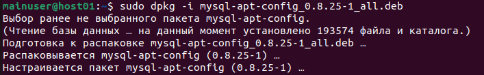
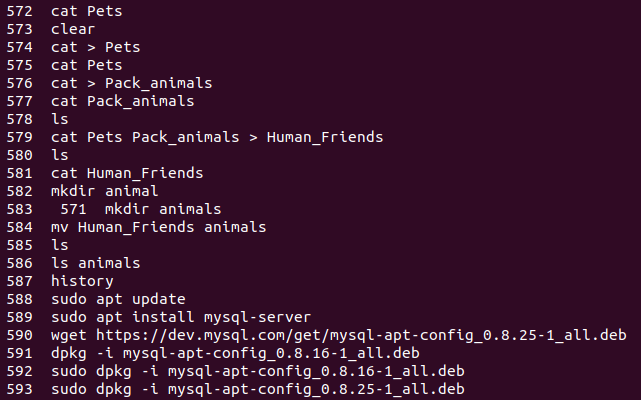

# Итоговая контрольная работа по блоку Специализация 5277

## Информация о проекте
Необходимо организовать систему учета для питомника в котором живут
домашние и вьючные животные.


## 1. Используя команду cat в терминале операционной системы Linux, создать
два файла Домашние животные (заполнив файл собаками, кошками,
хомяками) и Вьючные животными заполнив файл Лошадьми, верблюдами и
ослы), а затем объединить их. Переименовать файл, дав ему новое имя (Друзья человека). 
Просмотреть содержимое созданного файла. 

```sh
cat > Pets
dogs
cats
hamsters
```
```sh
cat > Pack_animals
horses
camels
donkeys
```
```sh
cat Pets Pack_animals > Human_Friends
```
```sh
cat Human_Friends
```


## 2. Создать директорию, переместить файл туда. 

```sh
mkdir animal
```
```sh
mv Human_Friends animal
```

3. Подключить дополнительный репозиторий MySQL. Установить любой пакет из этого репозитория.

```sh
apt update
apt install mysql-server
```



4. Установить и удалить deb-пакет с помощью dpkg.

```sh
wget https://dev.mysql.com/get/mysql-apt-config_0.8.25-1_all.deb
dpkg -i mysql-apt-config_0.8.25-1_all.deb
```



5. Выложить историю команд в терминале ubuntu


